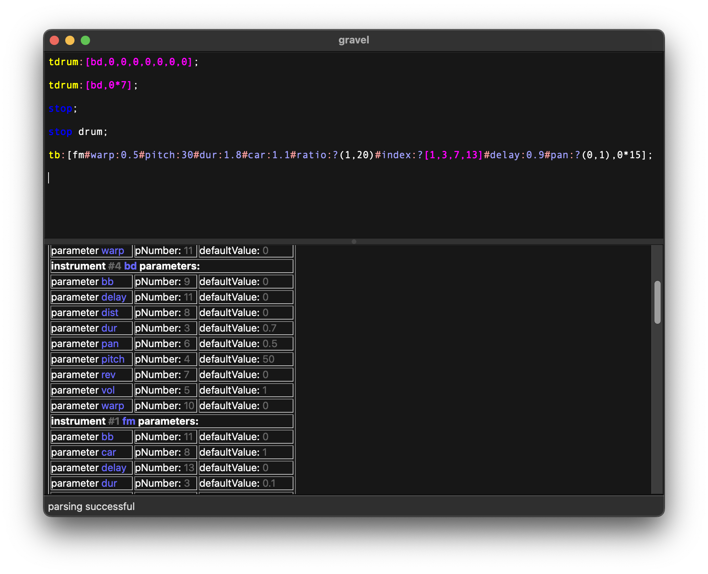

# Gravel Live Coding system

Gravel is a live coding system consisting on the sequencer and its editor via which the user controls the sequencer via its own domain specific programming language. The sound is generated by the buildin synthesizer which is made with the audio system Csound which loads an instrument definition file at program start. That script defines the different instruments, like bass drum, snare drum etc., which can be triggerd by the sequencer. With some experience in Csound language, the user can edit that file and create custom instruments and effects, and load it at the next program start without the need to recompile the Gravel application.

Additional to the instrument name which is used in Gravel to reference that instruments, various parameters can be also defined to control several aspects like the pitch and duration from the sequencer, which is one of the core features of Gravel. Its easy to vary or randomize these parameters in the sequencer and create so with little code complex, evolving patterns.

The top section with the syntax highlighted code is the main area in which the user types in and evaluates Gravel code. The contents can be stored as a textfile and later opened or merge loaded to existing code via the file function in the menu.

Below is non editable output area which contains useful information like the loaded instrument definition and all the parsed parameters which can be used in the Gravel sequencer. The blue colored names for instruments and parameters are the ones to use as reference in the sequencer.