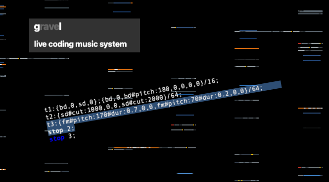

# gravel

- state: alpha version soon available

Gravel was originally started in September 2022 by [Tina Mariane Krogh Madsen](https://www.tmkm.dk) and [Malte Steiner](https://www.block4.com) to create a live coding system for their own practises such as the project [codepage](https://soundcloud.com/user-467798235).

Live coding is the most awkward way to operate a musical sequencer, instead of recording the pressing of buttons and twiddling knobs you write and evaluate code which unfolds to rythmical patterns and bars. So why do you want to do it? What it lacks on physical expressivity, it offers expressivity on code level. With a little code complex polyrythmical sequences can be created which evolves over time. The [Github Wiki](https://github.com/HerrSteiner/gravel/wiki) contains the documentation of Gravel language, but also a PDF will be available.

So basically Gravel is a sequencer with a code editor as GUI. It evaluates the given code and triggers a synthesizer which is implemented in the included [Csound](https://csound.com). The textfile **csoundInstruments.csd** contains the instrument definitions and is loaded by Gravel on program start. It can be, with some Csound knowledge, customized. It also defines the available parameters which can be automated in the sequencer.

Gravel is written in C++ with the library [QT](https://www.qt.io).
An alphaversion is soon available for Linx, Mac and Windows. Gravel is in its early stage and not even beta. But it was already successfully used by Malte Steiner in a concert at [Piksel](https://piksel.no) 2022 festival in Bergen, NO and will be presented at the [Code&Share](https://codeandshare.net) event in Aarhus 10. December 2022.

What's missing so far and soon will be implemented:
- an easier way to configure the midi device, so far the Csound script itself needs to be adapted
- a way to record audio on command, either the stereo sum or individual busses (synths, drums, fx) as multitrack WAV file
- synchronization works between other computers with Gravel (see [codepage concert in Helsinki 2024](https://youtu.be/WuVTTchpFso?si=BhLPoUcqfLv5Slyr)), missing is sync to studio equipment via Midi Clock
- the domain specific language Gravel is now in the process of being defined, implemented and tested. After Version 1.0 no more breaking changes, only additions

You can support this project by checking out our other music from our [label block 4](https://block4label.bandcamp.com).
